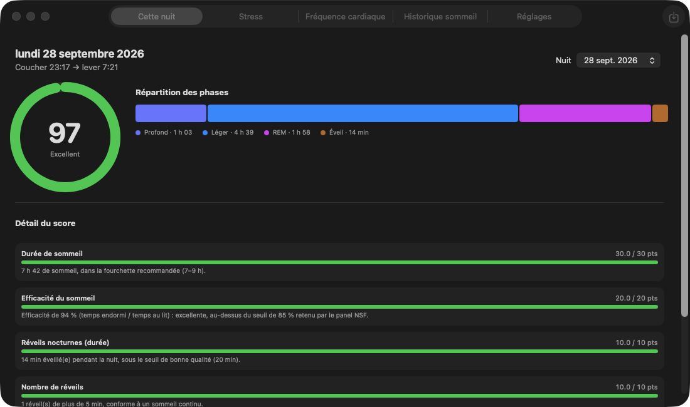
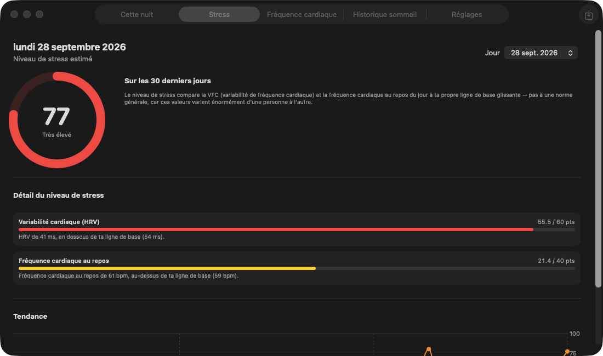
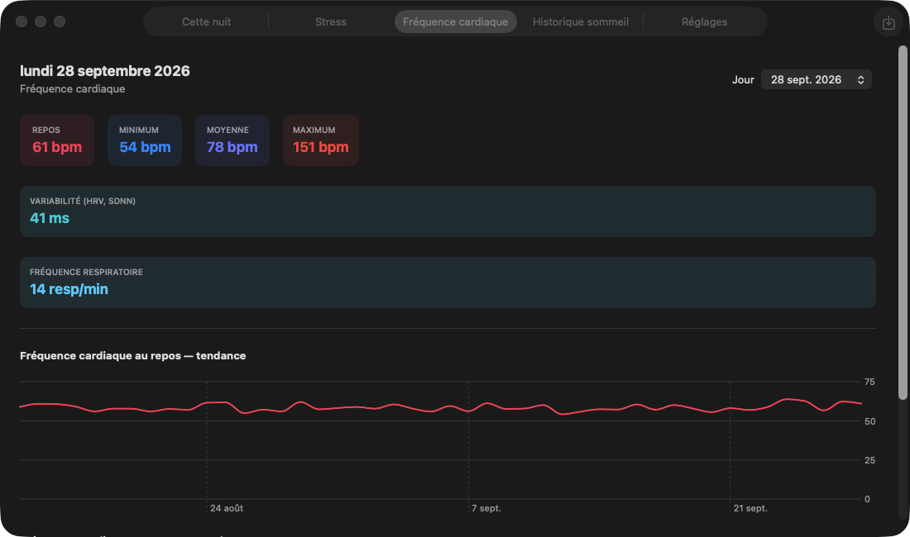
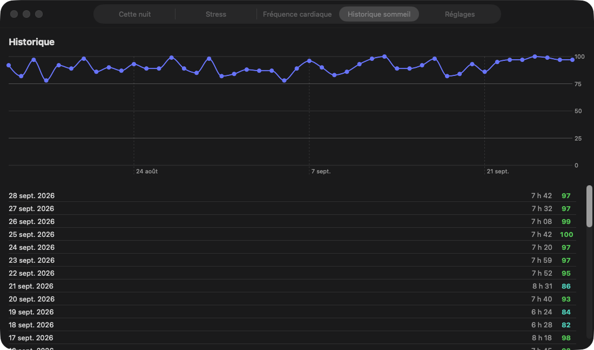

# Sommeil — Sleep Tracker for macOS

A native macOS app (SwiftUI) that turns your Apple Health export into a nightly sleep score, a daily stress level and heart-rate trends. Everything runs locally: no account, no network, no AI — every score is computed by a deterministic, documented algorithm.

> The app UI is in French.

## Screenshots

*Screenshots use generated demo data, not real health data.*

| Sleep score | Stress level |
| --- | --- |
|  |  |

| Heart rate | Sleep history |
| --- | --- |
|  |  |

## Features

- **Sleep score (0–100)** per night, weighting duration, efficiency, continuity (wake time and number of awakenings) and sleep architecture (deep / REM share). Thresholds come from the National Sleep Foundation consensus panel (Ohayon et al., 2017) and NSF duration recommendations (Hirshkowitz et al., 2015), adjusted for your age bracket.
- **Stress level (0–100)** per day, comparing your HRV (SDNN) and resting heart rate against your own rolling 30-day baseline rather than universal norms (at least 5 days of data required).
- **Heart rate** dashboard: resting, min, average and max heart rate, HRV and respiratory rate, with trend charts.
- **History** of sleep scores and durations.
- **Easy import**: the app detects a recent `export.zip` / `export.xml` in Downloads or Desktop and offers a one-click import. You can also drag and drop the file onto the window, or use *File → Import* (⌘O).

## Requirements

- macOS 13 or later
- Swift 5.9+ (Command Line Tools are enough, Xcode is not required)

## Build & run

```bash
./build_app.sh          # builds dist/SleepTracker.app
open dist/SleepTracker.app
```

Or run directly during development:

```bash
swift run SleepTracker
```

Run the self-tests (a small harness that works without XCTest):

```bash
swift run SleepTrackerSelfTests
```

## Getting your data

On your iPhone: **Health → profile picture → Export All Health Data**, then send the resulting `export.zip` to your Mac (AirDrop works well). Open the app and accept the import banner, or drop the file onto the window.

## Privacy

Your data never leaves your Mac. Parsed sessions and settings are cached as JSON in `~/Library/Application Support/SleepTracker/`; delete that folder to wipe everything.

## Project layout

```
Sources/
  SleepTracker/            SwiftUI app (views, app state, auto-import)
  SleepTrackerCore/        Health export parsing, models, scoring engines, persistence
  SleepTrackerSelfTests/   Self-test executable
AppResources/              Info.plist, app icon
build_app.sh               Packages the release build as a .app bundle
```

## Disclaimer

This app is not a medical device. Scores are informational estimates and must not be used for diagnosis.
